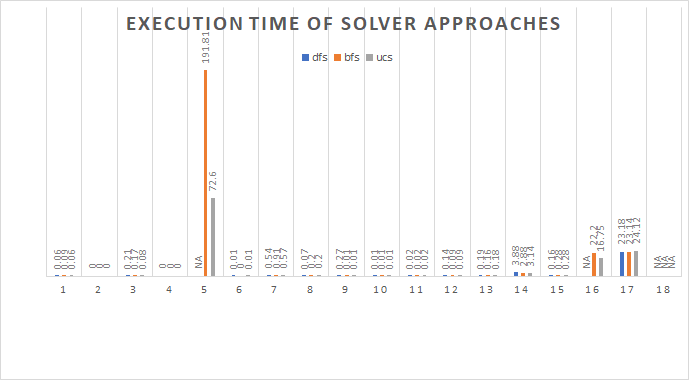
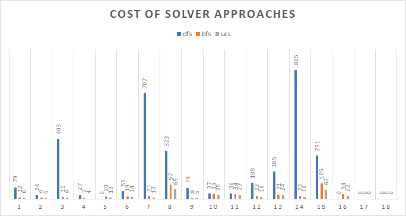

# Description
> University of Information Technology - VNUHCM

> Student ID: 20520043

> Name: Phan Doan Thai Binh

> Class: CS106.M21.KHTN

This report is to implement and explain a **Solver for Sokoban**
# Modeling 
First we scan the maze from txt file and transfer it to a matrix which cells stored numbers represent for: **0 - free space, 1 - wall, 2 - player, 3 - box, 4 - goal, 5 - box on goal**. 
# State definition
- **A legal move** is a move (go to North, South, East, West) that do not go into walls, do not go outside the matrix bound, and do not push a box that stucked
- **A state** is our board after each **legal move**. States are stored in computer by two list: position of player and position of each box
- **State space** is a **graph** which legal move in the game can be considered as transition from state to state (legal moves - **edges**, states - **vertices**) 
- **Cost** (integer) is the cost to get from a state to an other (weight of edges)
- **The starting state** is the base board transfer from the map 
- **The goal state** is the board when all boxs are on goals
> Thus, solving the game means searching a path from the starting state to the goal state
# Problem definition
- **startState**: 
	- beginBox: position of boxes (base maze)
	- beginPlayer: position of player (base maze)
- **isLegalAction(action, posPlayer, posBox)**: Check if the given action is legal
- **legalActions(posPlayer, posBox)**: all legal actions for the agent in the current game state
- **updateState(posPlayer, posBox, action)**: updated game state after an legal action is taken **(as succesor function)**
- **isFailed(posBox)**: used to observe if the state is potentially failed, then prune the search
- **isEndState(posBox)**: Check if all boxes are on the goals (i.e. pass the game)
- **cost(actions)**: use for calculating priority in **UCS** : return 0 if move push box, 1 otherwise. For **DFS** and **BFS**, it is actually just 1 for every action
# Solver implementation
## Approaches
- Depth-First Search (DFS)
- Breath-First Search (BFS)
- Uniform Cost Search (UCS)
## Test result
### Table of execution time(s) and cost
<table>
<thead>
  <tr>
    <th></th>
    <th colspan="3">execution time </th>
    <th colspan="3">cost</th>
  </tr>
</thead>
<tbody>
  <tr>
    <td>stage</td>
    <td>dfs</td>
    <td>bfs</td>
    <td>ucs</td>
    <td>dfscost</td>
    <td>bfscost</td>
    <td>ucscost </td>
  </tr>
  <tr>
    <td>1</td>
    <td>0.06</td>
    <td>0.09</td>
    <td>0.06</td>
    <td>79</td>
    <td>12</td>
    <td>6</td>
  </tr>
  <tr>
    <td>2</td>
    <td>0</td>
    <td>0</td>
    <td>0</td>
    <td>24</td>
    <td>9</td>
    <td>5</td>
  </tr>
  <tr>
    <td>3</td>
    <td>0.21</td>
    <td>0.17</td>
    <td>0.08</td>
    <td>403</td>
    <td>15</td>
    <td>9</td>
  </tr>
  <tr>
    <td>4</td>
    <td>0</td>
    <td>0</td>
    <td>0</td>
    <td>27</td>
    <td>7</td>
    <td>4</td>
  </tr>
  <tr>
    <td>5</td>
    <td>NA</td>
    <td>191.81</td>
    <td>72.6</td>
    <td>NA</td>
    <td>20</td>
    <td>10</td>
  </tr>
  <tr>
    <td>6</td>
    <td>0.01</td>
    <td>0</td>
    <td>0.01</td>
    <td>55</td>
    <td>19</td>
    <td>14</td>
  </tr>
  <tr>
    <td>7</td>
    <td>0.54</td>
    <td>0.91</td>
    <td>0.57</td>
    <td>707</td>
    <td>21</td>
    <td>10</td>
  </tr>
  <tr>
    <td>8</td>
    <td>0.07</td>
    <td>0.2</td>
    <td>0.2</td>
    <td>323</td>
    <td>97</td>
    <td>65</td>
  </tr>
  <tr>
    <td>9</td>
    <td>0.27</td>
    <td>0.01</td>
    <td>0.01</td>
    <td>74</td>
    <td>8</td>
    <td>5</td>
  </tr>
  <tr>
    <td>10</td>
    <td>0.01</td>
    <td>0.01</td>
    <td>0.01</td>
    <td>37</td>
    <td>33</td>
    <td>25</td>
  </tr>
  <tr>
    <td>11</td>
    <td>0.02</td>
    <td>0.02</td>
    <td>0.02</td>
    <td>36</td>
    <td>34</td>
    <td>27</td>
  </tr>
  <tr>
    <td>12</td>
    <td>0.14</td>
    <td>0.09</td>
    <td>0.09</td>
    <td>109</td>
    <td>23</td>
    <td>16</td>
  </tr>
  <tr>
    <td>13</td>
    <td>0.19</td>
    <td>0.16</td>
    <td>0.18</td>
    <td>185</td>
    <td>31</td>
    <td>24</td>
  </tr>
  <tr>
    <td>14</td>
    <td>3.88</td>
    <td>2.88</td>
    <td>3.14</td>
    <td>865</td>
    <td>23</td>
    <td>16</td>
  </tr>
  <tr>
    <td>15</td>
    <td>0.16</td>
    <td>0.28</td>
    <td>0.28</td>
    <td>291</td>
    <td>105</td>
    <td>62</td>
  </tr>
  <tr>
    <td>16</td>
    <td>NA</td>
    <td>22.2</td>
    <td>16.75</td>
    <td>NA</td>
    <td>34</td>
    <td>22</td>
  </tr>
  <tr>
    <td>17</td>
    <td>23.18</td>
    <td>23.14</td>
    <td>24.12</td>
    <td>nopath</td>
    <td>nopath</td>
    <td>nopath</td>
  </tr>
  <tr>
    <td>18</td>
    <td>NA</td>
    <td>NA</td>
    <td>NA</td>
    <td>NA</td>
    <td>NA</td>
    <td>NA</td>
  </tr>
</tbody>
</table>

- **NA** : infinity time to execute
- **nopath**: there is no path to win 
### Chart of execution time (s) and cost

&nbsp;
&nbsp;
# Discussion
- **DFS** explores more states than other approaches, resulting to longer execution time and longer cost (path length)
- **BFS** shows better performance than DFS in cases that the maze is *dense* - not have so many ways to go around (stage 1-7), it is worse than DFS when the maze is *sparse* - has larger spaces to go around (stage 8-16)
- **UCS** seems like the best approache in almost every cases, the reason is that we chose a good cost-calculate-function (which cost 0 for push box and 1 for do not) - it is actually just *greedy*
- In **stage 5**: it took us so much time to execute in all approaches (even forever with DFS), it is because the stage has 3 boxes and many many empty cells to go, it even has no obstacle-wall, so our player will just turn around somewhere (so many legal move -> so many state, the graph will be so *dense*) and will slowly approach to the boxes and goals 
- **Stage 18** is just a nightmare with ten boxes and ten goals that be next to each others, if we dont have any heuristics or greedy that create a strategy to push the boxes to goals in good order, we will almost try every state and will never be able to reach the goal state!
# Reference
https://stanford-cs221.github.io/autumn2019-extra/posters/17.pdf